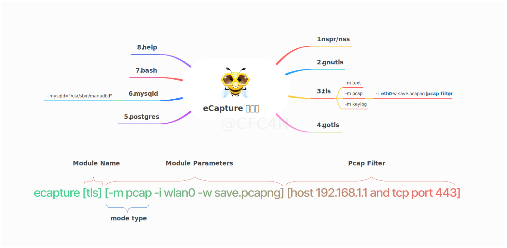

[中文介绍](./README_CN.md) | [English](./README.md) | 日本語

[](https://github.com/gojue/ecapture)
[](https://github.com/gojue/ecapture)
[](https://github.com/gojue/ecapture/actions/workflows/code-analysis.yml)
[](https://github.com/gojue/ecapture/releases)

### eCapture(傍観者):  CA証明書なしで SSL/TLS のテキストコンテンツをキャプチャする eBPF を使用。

> **注**
>
> Linux/Android カーネルバージョン x86_64 4.18 以上、**aarch64 5.5** 以上に対応しています。
> Windows、macOS には対応していません。
----


- [紹介](#紹介)
- [早速始めましょう](#早速始めましょう)
  - [ダウンロード](#ダウンロード)
    - [ELF実行ファイル](#ELF実行ファイル)
    - [Docker-コンテナイメージ](#Docker-コンテナイメージ)
  - [使用例](#使用例)
  - [モジュール紹介](#モジュール紹介)
    - [openssl-モジュール](#openssl-モジュール)
    - [Pcap-モジュール](#Pcap-モジュール)
    - [keylog-モジュール](#keylog-モジュール)
    - [gotls-モジュール](#gotls-モジュール)
    - [その他のモジュール](#その他のモジュール)
  - [使用デモ](#使用デモ)
- [スターチャート成長曲線](#スターチャート成長曲線)
- [貢献](#貢献)
- [コンパイル](#コンパイル)
- [WeChat公式アカウント](#WeChat公式アカウント)

----

# 紹介

eCaptureの中国語名は**傍観者**で、「**岡目八目**」という意味です。これは、その機能である**傍路化・観察**と一致し、英語の発音にも似ています。eCaptureはeBPFの`Uprobe`/`Traffic Control`技術を用いて、ユーザースペースやカーネルスペースのデータをキャプチャし、元のプログラムを変更することなく実行できます。

# 早速始めましょう

## ダウンロード

### ELF実行ファイル

> **注意**
>
> Linux/Androidのx86_64/aarch64 CPUアーキテクチャをサポートしています。

ダウンロード [release](https://github.com/gojue/ecapture/releases) のバイナリパッケージを直接使用できます。

### Docker コンテナイメージ

> **注意**
>
> Linux x86_64/aarch64 のみをサポートしています。

```shell
# イメージをプルする
docker pull gojue/ecapture:latest
# 実行
docker run --rm --privileged=true --net=host -v ${ホスト側のファイルパス}:${コンテナ内のパス} gojue/ecapture ARGS
```

## 使用例



Openssl動的リンクライブラリに基づくネットワーク通信をキャプチャします。

```shell
sudo ecapture tls
2024-09-15T11:50:28Z INF AppName="eCapture(旁观者)"
2024-09-15T11:50:28Z INF HomePage=https://ecapture.cc
2024-09-15T11:50:28Z INF Repository=https://github.com/gojue/ecapture
2024-09-15T11:50:28Z INF Author="CFC4N <cfc4ncs@gmail.com>"
2024-09-15T11:50:28Z INF Description="Capturing SSL/TLS plaintext without a CA certificate using eBPF. Supported on Linux/Android kernels for amd64/arm64."
2024-09-15T11:50:28Z INF Version=linux_arm64:0.8.6-20240915-d87ae48:5.15.0-113-generic
2024-09-15T11:50:28Z INF Listen=localhost:28256
2024-09-15T11:50:28Z INF eCapture running logs logger=
2024-09-15T11:50:28Z INF the file handler that receives the captured event eventCollector=
2024-09-15T11:50:28Z WRN ========== module starting. ==========
2024-09-15T11:50:28Z INF listen=localhost:28256
2024-09-15T11:50:28Z INF https server starting...You can update the configuration file via the HTTP interface.
2024-09-15T11:50:28Z INF Kernel Info=5.15.152 Pid=233458
2024-09-15T11:50:28Z INF BTF bytecode mode: CORE. btfMode=0
2024-09-15T11:50:28Z INF master key keylogger has been set. eBPFProgramType=Text keylogger=
2024-09-15T11:50:28Z INF module initialization. isReload=false moduleName=EBPFProbeOPENSSL
2024-09-15T11:50:28Z INF Module.Run()
2024-09-15T11:50:28Z WRN OpenSSL/BoringSSL version not found from shared library file, used default version OpenSSL Version=linux_default_3_0
2024-09-15T11:50:28Z INF Hook masterKey function ElfType=2 Functions=["SSL_get_wbio","SSL_in_before","SSL_do_handshake"] binrayPath=/usr/lib/aarch64-linux-gnu/libssl.so.3
2024-09-15T11:50:28Z INF target all process.
2024-09-15T11:50:28Z INF target all users.
2024-09-15T11:50:28Z INF setupManagers eBPFProgramType=Text
2024-09-15T11:50:28Z INF BPF bytecode file is matched. bpfFileName=user/bytecode/openssl_3_0_0_kern_core.o
2024-09-15T11:50:28Z INF perfEventReader created mapSize(MB)=4
2024-09-15T11:50:28Z INF perfEventReader created mapSize(MB)=4
2024-09-15T11:50:28Z INF module started successfully. isReload=false moduleName=EBPFProbeOPENSSL
2024-09-15T11:50:31Z ??? UUID:233479_233479_curl_5_1_39.156.66.10:443, Name:HTTPRequest, Type:1, Length:73
GET / HTTP/1.1
Host: baidu.com
Accept: */*
User-Agent: curl/7.81.0


2024-09-15T11:50:32Z ??? UUID:233479_233479_curl_5_0_39.156.66.10:443, Name:HTTPResponse, Type:3, Length:357
HTTP/1.1 302 Moved Temporarily
Content-Length: 161
Connection: keep-alive
Content-Type: text/html
Date: Sun, 15 Sep 2024 11:50:30 GMT
Location: http://www.baidu.com/
Server: bfe/1.0.8.18

<html>
<head><title>302 Found</title></head>
<body bgcolor="white">
<center><h1>302 Found</h1></center>
<hr><center>bfe/1.0.8.18</center>
</body>
</html>
```

## モジュール紹介
eCaptureには8つのモジュールが存在し、それぞれがopenssl/gnutls/nspr/boringssl/gotlsなどのライブラリをサポートしています。これらのモジュールはTLS/SSL暗号ライブラリのプレーンテキストキャプチャや、Bash、MySQL、PostgreSQLなどのソフトウェアの監査を行えます。

* bash - bashコマンドラインの入出力をキャプチャします。
* gnutls - gnutlsライブラリに基づく暗号化通信のプレーンテキストコンテンツをキャプチャします。
* gotls - Golang言語で書かれた、組み込みcryptライブラリに基づくTLS/HTTPS暗号化通信のプレーンテキストコンテンツをキャプチャします。
* mysqld - MysqldのSQLクエリをキャプチャし、データベース監査シナリオに適しています。Mysqld 5.6/5.7/8.0などのバージョンをサポートしています。
* nss - nssライブラリに基づく暗号化通信のプレーンテキストコンテンツをキャプチャします。
* postgres - postgres 10+のデータベース監査をサポートし、クエリ文をキャプチャします。
* tls - Openssl/Boringsslに基づく暗号化通信のプレーンテキストコンテンツをキャプチャします。Openssl 1.0.x/1.1.x/3.xおよびそれ以降のバージョン、BoringSSLのすべてのリリースバージョンをサポートしています。

これらのコマンドのリストは、`ecapture -h`を実行することで参照できます。

### openssl モジュール

`sudo ecapture -h`を実行して詳細なヘルプドキュメントを参照してください。

eCaptureはデフォルトで`/etc/ld.so.conf`ファイルを探し、SOファイルのロードディレクトリを確認し、`openssl`などの動的リンクライブラリの位置を探します。また、`--libssl`パラメータを使用して動的リンクライブラリのパスを指定することもできます。

ターゲットプログラムが静的コンパイル方式を使用している場合は、`--libssl`パラメータをそのプログラムのパスに設定することができます。

opensslモジュールは3つのキャプチャモードをサポートしています。

- pcap/pcapngモード：キャプチャしたプレーンテキストデータをpcap-NG形式で保存します。
- keylog/keyモード：TLSのハンドシェイクキーをファイルに保存します。
- textモード：プレーンテキストデータを直接キャプチャし、指定されたファイルに出力するか、コマンドラインに表示します。

#### Pcap モジュール

TLS暗号化をサポートするTCPベースのHTTP `1.0/1.1/2.0`アプリケーション層プロトコル、およびUDPを基盤とするHTTP3の`QUIC`アプリケーション層プロトコルに対応しています。
`-m pcap`や`-m pcapng`というパラメーターで指定することができ、`--pcapfile`や`-i`というパラメーターと組み合わせて使用する必要があります。`--pcapfile`というパラメーターのデフォルト値は`ecapture_openssl.pcapng`です。

```shell
sudo ecapture tls -m pcap -i eth0 --pcapfile=ecapture.pcapng tcp port 443
2024-09-15T06:54:12Z INF AppName="eCapture(旁观者)"
2024-09-15T06:54:12Z INF HomePage=https://ecapture.cc
2024-09-15T06:54:12Z INF Repository=https://github.com/gojue/ecapture
2024-09-15T06:54:12Z INF Author="CFC4N <cfc4ncs@gmail.com>"
2024-09-15T06:54:12Z INF Description="Capturing SSL/TLS plaintext without a CA certificate using eBPF. Supported on Linux/Android kernels for amd64/arm64."
2024-09-15T06:54:12Z INF Version=linux_arm64:0.8.6-20240915-d87ae48:5.15.0-113-generic
2024-09-15T06:54:12Z INF Listen=localhost:28256
2024-09-15T06:54:12Z INF eCapture running logs logger=
2024-09-15T06:54:12Z INF the file handler that receives the captured event eventCollector=
2024-09-15T06:54:12Z WRN ========== module starting. ==========
2024-09-15T06:54:12Z INF Kernel Info=5.15.152 Pid=230440
2024-09-15T06:54:12Z INF BTF bytecode mode: CORE. btfMode=0
2024-09-15T06:54:12Z INF listen=localhost:28256
2024-09-15T06:54:12Z INF module initialization. isReload=false moduleName=EBPFProbeOPENSSL
2024-09-15T06:54:12Z INF Module.Run()
2024-09-15T06:54:12Z INF https server starting...You can update the configuration file via the HTTP interface.
2024-09-15T06:54:12Z WRN OpenSSL/BoringSSL version not found from shared library file, used default version OpenSSL Version=linux_default_3_0
2024-09-15T06:54:12Z INF HOOK type:Openssl elf ElfType=2 IFindex=2 IFname=ens160 PcapFilter= binrayPath=/usr/lib/aarch64-linux-gnu/libssl.so.3
2024-09-15T06:54:12Z INF Hook masterKey function Functions=["SSL_get_wbio","SSL_in_before","SSL_do_handshake"]
2024-09-15T06:54:12Z INF target all process.
2024-09-15T06:54:12Z INF target all users.
2024-09-15T06:54:12Z INF setupManagers eBPFProgramType=PcapNG
2024-09-15T06:54:12Z INF BPF bytecode file is matched. bpfFileName=user/bytecode/openssl_3_0_0_kern_core.o
2024-09-15T06:54:12Z INF packets saved into pcapng file. pcapng path=/home/ecapture/ecapture.pcapng
2024-09-15T06:54:12Z INF perfEventReader created mapSize(MB)=4
2024-09-15T06:54:12Z INF perfEventReader created mapSize(MB)=4
2024-09-15T06:54:12Z INF module started successfully. isReload=false moduleName=EBPFProbeOPENSSL
2024-09-15T06:54:14Z INF packets saved into pcapng file. count=4
2024-09-15T06:54:16Z INF non-TLSv1.3 cipher suite found CLientRandom=f08e8d784962d1693c042f9fe266345507ccfaba58b823904a357f30dbfa1e71 CipherId=0
2024-09-15T06:54:16Z INF non-TLSv1.3 cipher suite found CLientRandom=f08e8d784962d1693c042f9fe266345507ccfaba58b823904a357f30dbfa1e71 CipherId=0
2024-09-15T06:54:16Z INF packets saved into pcapng file. count=183
2024-09-15T06:54:16Z INF CLIENT_RANDOM save success CLientRandom=f08e8d784962d1693c042f9fe266345507ccfaba58b823904a357f30dbfa1e71 TlsVersion=TLS1_2_VERSION bytes=176
2024-09-15T06:54:18Z INF packets saved into pcapng file. count=65
^C2024-09-15T06:54:18Z INF module close.
2024-09-15T06:54:18Z INF packets saved into pcapng file. count=3
2024-09-15T06:54:18Z INF packets saved into pcapng file. count=255
2024-09-15T06:54:18Z INF Module closed,message recived from Context
2024-09-15T06:54:18Z INF iModule module close
2024-09-15T06:54:18Z INF bye bye.
```

キャプチャしたプレーンテキストデータパケットをpcapngファイルに保存し、次に`Wireshark`で開いて参照すると、プレーンテキストのネットワークパケットを見ることができます。

#### keylog モジュール
`-m keylog`や`-m key`というパラメーターを用いて指定することができ、`--keylogfile`というパラメーターと組み合わせて使用する必要があります。デフォルトでは`ecapture_masterkey.log`に保存されます。
キャプチャされたOpenSSL TLSのキー`Master Secret`情報は、`--keylogfile`で指定されたファイルに保存されます。同時に`tcpdump`でパケットキャプチャを開始し、`Wireshark`で開く際に`Master Secret`のパスを設定して、プレーンテキストのデータパケットを確認することもできます。

```shell
sudo ecapture tls -m keylog -keylogfile=openssl_keylog.log
```

また、`tshark`ソフトウェアを直接使用してリアルタイムに復号化し表示することもできます。
```shell
tshark -o tls.keylog_file:ecapture_masterkey.log -Y http -T fields -e http.file_data -f "port 443" -i eth0
```

#### テキストモード

`sudo ecapture tls -m text` コマンドはすべてのプレーンテキストデータパケットを出力します。(v0.7.0から、SSLKEYLOG情報をキャプチャしなくなりました。)

### gotls モジュール

opensslモジュールと同様です。

#### 起動環境の検証方法：

```shell
cfc4n@vm-server:~$# uname -r
4.18.0-305.3.1.el8.x86_64
cfc4n@vm-server:~$# cat /boot/config-`uname -r` | grep CONFIG_DEBUG_INFO_BTF
CONFIG_DEBUG_INFO_BTF=y
```

#### eCaptureを起動する
```shell
sudo ecapture gotls --elfpath=/home/cfc4n/go_https_client --hex
```

#### プログラムの起動：

そのプログラムがHTTPSリクエストをトリガーすることを確認してください。

```shell
/home/cfc4n/go_https_client
```

#### より多くのヘルプ
```shell
sudo ecapture gotls -h
```

### その他のモジュール

eCaptureは他にも`bash`、`mysql`、`nss`、`postgres`などのモジュールをサポートしています。詳細なヘルプドキュメントは`ecapture -h`を実行することで参照できます。

## 使用デモ

### 紹介記事

[eCapture：无需CA证书抓https明文通讯](https://mp.weixin.qq.com/s/DvTClH3JmncpkaEfnTQsRg)

### 動画：LinuxでeCaptureを使用

[](https://www.bilibili.com/video/BV1si4y1Q74a "eCapture User Manual")

### 動画：AndroidでeCaptureを使用

[](https://www.bilibili.com/video/BV1xP4y1Z7HB "eCapture for Android")

## スターチャート成長曲線

[](https://starchart.cc/gojue/ecapture)

# 貢献

[CONTRIBUTING](./CONTRIBUTING.md)の説明を参考に、バグ、パッチ、提案などを投稿してください。大変感謝しています。

# コンパイル

あなたは自分で望む機能をカスタマイズすることができます。たとえば、静的コンパイルされたOpensslライブラリをサポートするために`uprobe`のオフセットアドレスを設定することができます。コンパイル方法については、[COMPILATION](./COMPILATION_CN.md)の説明を参照してください。

# WeChat公式アカウント


